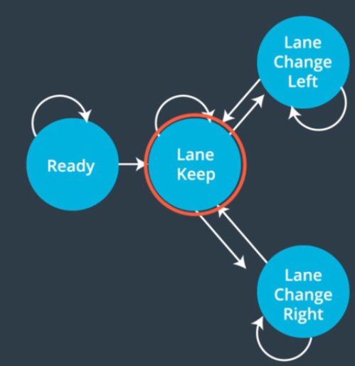

# CarND_Path_Planning

<p align="center">
  
</p>

## Installation:

The [CarND-Path-Plannig-Project](https://github.com/AndresGarciaEscalante/CarND_Path_Planning/tree/master/CarND-Path-Planning-Project) README.md in the repository provides with all the installation steps to ***download and execute the simulator***. 

Once the simulator is installed follow the next steps to run the code:

* In the  ***CarND-Path-Planning*** execute the following commands:

```
$ mkdir build && cd build
$ cmake .. && make
$ ./path_planning
```

* In another terminal, go to the folder where the simulator is located and then run the following commands:

```
$ mkdir chmod +x term3_sim.x86_64
$ ./term3_sim.x86_64
```

* A new windows should pop up and select the path planning project.

* As soon as the simulation starts the car must move autonomously.

## Project Description
Implement a safe autonomous navigation in a simulated 3D environment. In the simulation there will be cars that are in all lanes of the highway and they will have different speeds. The autonomous car needs to be able to avoid collision with other cars, not exceed the maximum velocity of 50 MPH, not exceed the maximum acceleration, not exceed the maximum jerk, and create smooth trajectories.

The following functions were implemented to estimate the car's position:

### Prediction Function
The simulator provides us with all the sensor fusion data, which is useful to predict the movements of the other cars. For this approach, I analyse all the cars that are sensed and classify them into six categories:

    * left_front_car   (Car detected ahead of me in the left lane)
    * mid_front_car    (Car detected ahead of me in the mid lane)
    * right_front_car  (Car detected ahead of me in the right lane)
    * left_behind_car  (Car detected behind of me in the left lane)
    * mid_behind_car   (Car detected behind of me in the mid lane)
    * right_behind_car (Car detected behind of me in the right lane)

All the previous variables will keep track of possible risks when making decisions in the following functions.

### Next Sucessors Function
A Finite State Machine (FSM) was used to represent all the states and their respective transition of states. This function allows to store the possible transition states from a given state. 

<p align="center">
  
</p>


### Behavior Planning Function
This function is responsible to decide which of the possible states is more likely to be the best state for any case. Inside this function we have the ***Get_Trajectory_Function*** and the ***Cost_Function***.  

#### Get Trajectory Function
It is responsible to generate a set of points that will be interpolated using the ***spline library***. The trajectories will depend of the ***possible_state*** of the car. 

#### Cost Function
The cost funtion evaluates each of the possible states and assign them a **cost value**. For this approach two cost functions were implemented:

    * Trajectories that are outside the three lanes will be penalized. 
    * Distance from the other cars (The closer the cars the greater the cost). 

## Project Outcome
The car was able to complete drive autonomously without breaking any of the restrictions. 

***Important:*** Check the full video of the [Path_Planning_Project](https://www.youtube.com/watch?v=NT0T6DYoP18)
